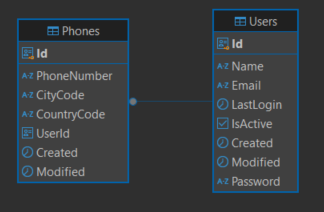
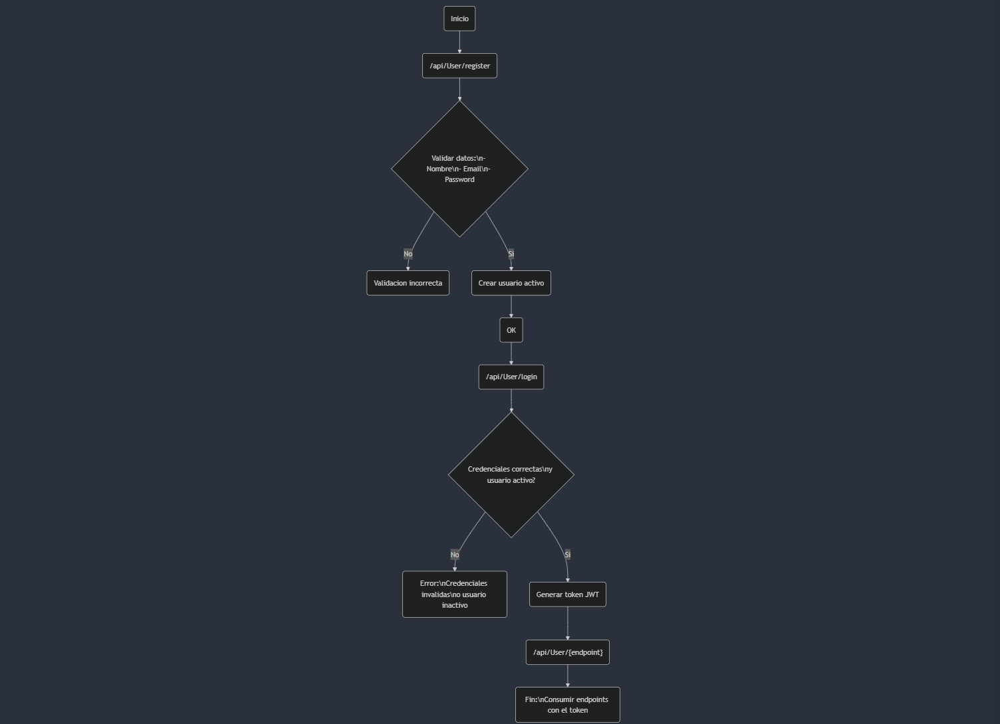

# 🚀 UserControl API - .NET 8 + PostgreSQL

[](https://dotnet.microsoft.com/download/dotnet/8.0)
[](./LICENSE) 


Este proyecto es un servicio **RESTful** basado en **.NET 8** que permite la gestión eficiente de usuarios, incluyendo:
- 📌 **Operaciones CRUD (Create, Read, Update, Delete)**.
- ✅ **Autenticación con JWT**.
- 📦 **Integración con PostgreSQL**.
- 🛠 **Validación de usuarios** (convalidaciones personalizadas de contraseña y email).
- 🌍 **EndPoints para gestión de usuarios y autenticación**.


## Tabla de Contenidos
1. [Estructura del Proyecto](#estructura-del-proyecto)
2. [Diagramas del proyecto](#diagramas-del-proyecto)
3. [Instalación y Configuración](#instalación-y-configuración)
4. [Endpoints REST API](#endpoints-rest-api)
5. [Pruebas Unitarias](#pruebas-unitarias)


---


## Tabla de Contenidos
1. [Estructura del Proyecto](#estructura)
2. [Diagramas del proyecto](#diagramas)
3. [Instalación y Configuración](#instalacion)
4. [Endpoints REST API](#endpoints)
5. [Pruebas Unitarias](#pruebas)

---


## Estructura del Proyecto <a name="estructura"></a>

Aquí va tu contenido...

---

## Diagramas del proyecto <a name="diagramas"></a>

Aquí va tu contenido...

---

## 🔧 Instalación y Configuración <a name="instalacion"></a>

Información de configuración, Docker, .NET, etc.

---

## 📡 Endpoints REST API <a name="endpoints"></a>

Tabla de endpoints...

---

## ✅ Pruebas Unitarias <a name="pruebas"></a>

Cómo ejecutarlas, etc.


## Estructura del Proyecto
```

📆 UserControl
├── 📂 UserControl.API   # Proyecto API para exponer los endpoints
│   ├── 📂 Controllers   # Controladores de la API 
│   ├── 📂 Properties    # Archivos de configuración ...
│   ├── 📂 Dependencies  # Configuración y recursos compartidos ...
│   ├── 🗎 appsettings.json
│   ├── 🗎 Dockerfile
│   └── 🗎 Program.cs    
│
├── 📂 UserControl.Core  #  Proyecto base donde se manejan recursos compartidos en el app
│   ├── 📂 Abstractions  # Contratos o interfaces
│   ├── 📂 Dtos          # DTOs de entrada y salida DE LOS ENDPOINT
│   └── 📂 Exceptions    # Excepciones personalizadas
│
├── 📂 UserControl.Model # Entidades del dominio
│   ├── 📂 Configurations 
│   ├── 📂 Context       # DbContext para la base de datos
│   ├── 📂 Entities      # UserEntity, PhoneEntity, etc.
│   └── 📂 Migrations    # Migraciones de la base de datos
│
├── 📂 UserControl.Repository Proyecto que maneja el acceso a la capa de datos del app
│   ├── 📂 Dependencies  
│   └── 📂 Projections   # Mapeos entre entidades y DTOs
│
├── 📂 UserControl.Services Proyecto donde se encuentra el servicio que maneja la logica de negocio del Usuario
│   └── 📂 Validators    # Clases de validación (FluentValidation, etc.)
│
├── 📂 UserControl.Tests # Tests unitarios
│   ├── 📂 UserUnitTest  # Pruebas unitarias del registro de usuarios
│   └── 📂 Mocks         # Clases e interfaces simuladas para pruebas
│  📂 docs              # Diagramas del proyecto y scripts de SQL para la creacion e insercion de datos en la BD
└── 🗎 README.md         # Documentación general
```

---

## Diagramas del proyecto

### Diagrama Entidad Relacion


### Diagrama de Solucion


---


## Instalación y Configuración

### **1️⃣ Prerrequisitos**
Asegúrate de tener instalados:
- **.NET 8 SDK** → [Descargar](https://dotnet.microsoft.com/download/dotnet/8.0)
- - **Visual Studio 2022 Community** → [Descargar]([https://dotnet.microsoft.com/download/dotnet/8.0](https://visualstudio.microsoft.com/vs/community/))
- **PostgreSQL** → [Instalar](https://www.postgresql.org/download/)
- **Docker** → [Instalar](https://docs.docker.com/get-docker/)

### **2️⃣ Clona el repositorio**
```sh
git clone https://github.com/Arielhenriquez/UserControl.API.git
cd usercontrol
```


### **3️⃣ Configura Docker y la base de datos**

Puedes ejecutar PostgreSQL localmente usando Docker:

```bash
docker run -d \
  --name=user_contact_db \
  --hostname=fc0d7a0e7e46 \
  --env=POSTGRES_USER=admin \
  --env=POSTGRES_PASSWORD=PASSWORD \
  --env=POSTGRES_DB=usersDb \
  -p 5432:5432 \
  --volume=/var/lib/postgresql/data \
  --restart=no \
  postgres:latest
```


-d ejecuta el contenedor en segundo plano.

--name nombra el contenedor para identificarlo fácilmente.

--hostname define el hostname interno del contenedor.

--env=POSTGRES_USER=admin establece el usuario principal de la base de datos.

--env=POSTGRES_PASSWORD=PASSWORD contraseña para dicho usuario.

--env=POSTGRES_DB=usersDb crea e inicializa una base de datos con ese nombre. 

-p 5432:5432 mapea el puerto 5432 del contenedor al 5432 de tu máquina local.

--volume=/var/lib/postgresql/data almacena los datos de PostgreSQL de manera persistente.

--restart=no no reinicia automáticamente el contenedor al fallar o reiniciar la máquina.

postgres:latest imagen oficial de PostgreSQL en su versión más reciente.

Nota: Dicho comando debe ejecutarse en una sola linea

4️⃣ Configura las variables de entorno
Crea un archivo appsettings.json o usa User Secrets de .NET para configurar la base de datos, el JWT :

```json
{
    "Logging": {
        "LogLevel": {
            "Default": "Information",
            "Microsoft.AspNetCore": "Information" //Logs cuando se ejecutan los endpoints en el app
        }
    },

    "PasswordConfig": {
        "PasswordRegexPattern": "^(?=.*[a-z])(?=.*[A-Z])(?=.*\\W).{7,}$" // Regex para configurar las validacione la contraseña. ahora mismo valida 7 caracteres una mayuscula y un simbolo
    },

    "ConnectionStrings": {
        "DefaultConnection": "Server=localhost;Port=5432;Database=usersDb;Username=admin;Password=PASSWORD;" //Conexion para BD. el puerto, el nombre de la base de datos, el usuario y password son los mismos que colocamos en Docker
    },
    "Jwt": {
        "Key": "Api WebAuth Swagger Token AspNetCore WebApi Testing Endpoints Auth Login",
        "Issuer": "UserContactApi",
        "Audience": "UserContactAudience"
    },


    "AllowedHosts": "*"
}

```

🚀 Ejecutar la Aplicación
Desde Visual studio presionar F5 para correr el proyecto o ubicarse en el boton verde arriba para ejecutar el proyecto. 
Este abre en el navegador a esta URL: https://localhost:7059/swagger/index.html

## Endpoints REST API 

| Método   | Endpoint                         | Descripción                                               |
|----------|----------------------------------|-----------------------------------------------------------|
| `POST`   | `/api/User/register`             | Registra un nuevo usuario junto con sus teléfonos.        |
| `POST`   | `/api/User/login`                | Inicia sesión con las credenciales del usuario y devuelve un JWT. |
| `POST`   | `/api/User/{userId}/active`      | Cambia el estatus de un usuario (activo/inactivo).        |
| `PUT`    | `/api/User/{id}`                 | Actualiza los datos de un usuario.                        |
| `DELETE` | `/api/User/{id}`                 | Elimina un usuario por su ID.                             |
| `GET`    | `/api/User/{id}`                 | Obtiene los detalles de un usuario por su ID.             |
| `GET`    | `/api/User`                      | Obtiene todos los usuarios.                               |


## Pruebas unitarias 
En visual studio ubicarse en la parte superior izquierda y darle al menu despleglable View y luego a test explorer.
Ya en ese apartado puede ejecutar uno o ambos unit test

